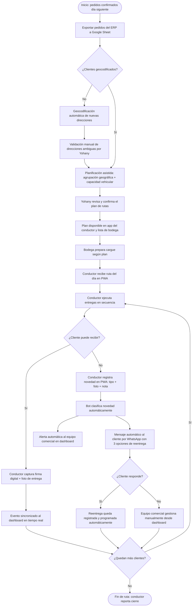
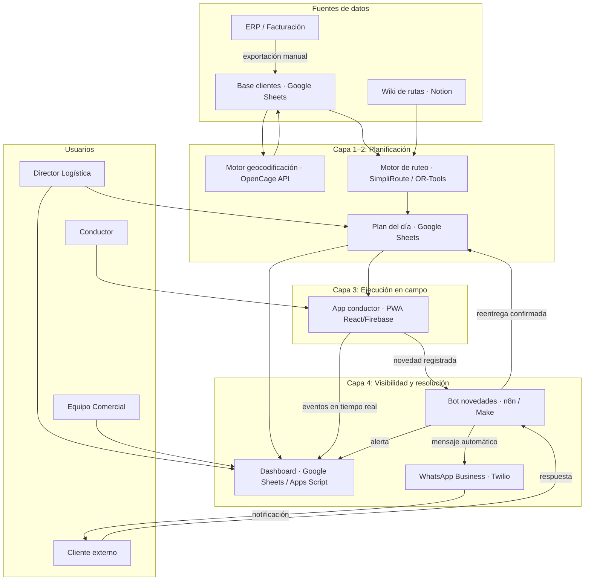
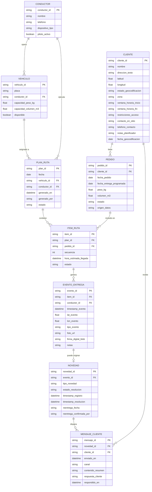

# PRD — Logistics Ops Hub
## Centro de Control Operativo de Entregas · Discordoba S.A.S.

---

## 1. Resumen Ejecutivo

**Logistics Ops Hub** es una plataforma operativa integrada que transforma la gestión de entregas de Discordoba S.A.S., reemplazando la planificación manual en Excel de 2,5 horas diarias y la ceguera operativa actual por un flujo digital de cuatro capas: geocodificación de clientes, planificación asistida de rutas, ejecución digital en campo con firma digital y visibilidad en tiempo real con resolución automática de novedades. Este MVP está dirigido al Director de Logística y su equipo operativo y busca reducir el dolor operativo cuantificado en **$132,5 millones COP/año**, eliminando las 3 devoluciones diarias promedio, las 2–3 horas extra por mal enrutamiento y la dependencia crítica de una sola persona para planificar las rutas de 30 pedidos diarios en 4–5 vehículos.

---

## 2. Problema y Contexto

### Descripción del problema central

La operación de entregas de Discordoba funciona como cinco silos desconectados que se comunican por teléfono y Excel al cierre del día. El planificador de rutas —una única persona— construye manualmente cada tarde la asignación de pedidos a vehículos basándose en su conocimiento personal de zonas y clientes, sin considerar tiempos reales de tránsito, ventanas horarias ni capacidad real de carga. Los conductores reciben instrucciones por llamada telefónica y operan sin soporte digital en campo. La empresa no sabe qué ocurre en ruta hasta que los vehículos regresan a bodega.

### Consecuencias operativas actuales (datos del Reporte Final — 7 marzo 2026)

| Componente del dolor | Dato actual | Costo anual estimado (COP) |
|---|---|---|
| Planificación manual de rutas | 2 h 30 min/día por 1 persona | $8.125.000 |
| Devoluciones de mercancía | ~3/día · 15/semana · 780/año | $62.400.000 |
| Horas extras de conductores | 2–3 h/día · 4 conductores | $26.000.000 |
| Vehículos adicionales en días pico | ~8 días/mes no planificados | $24.000.000 |
| Pérdida de clientes por incumplimiento | ~6 cuentas/año | $12.000.000 |
| **Total dolor anual estimado** | | **$132.525.000** |

> <!-- SUPUESTO: Los valores económicos son estimaciones del Reporte Final de Consultoría. Deben ser validados con el área financiera de Discordoba antes del DemoDay. -->

### Proceso actual (AS-IS) — limitaciones críticas

- **Dependencia de una sola persona:** todo el conocimiento de rutas, zonas y clientes es tácito y reside en el planificador. Si no está disponible, la operación se paraliza.
- **Sin visibilidad durante el día:** las novedades (devoluciones, cliente ausente, dirección errónea) solo se conocen cuando el vehículo retorna a bodega al cierre de jornada.
- **Comunicación sin registro:** la ruta se transmite verbalmente al conductor por llamada telefónica, sin soporte escrito ni digital.
- **Comprobante físico como único soporte:** la factura firmada en papel es el único registro de entrega exitosa. Sin trazabilidad digital, sin geolocalización, sin timestamp.
- **Reprogramación manual y lenta:** resolver una devolución requiere múltiples llamadas entre conductor, equipo comercial y cliente, pudiendo demorar hasta 24 horas.
- **Desbalance semanal de carga:** días pico generan necesidad de vehículos adicionales no planificados ($250.000/día); días bajos subutilizan la flota.

### Alternativas existentes y sus limitaciones

- **Excel + teléfono (estado actual):** funcional pero completamente manual, sin escalabilidad y con riesgo operativo crítico por dependencia de una persona.
- **SaaS de ruteo (SimpliRoute, LogiApp, Beetrack):** plataformas maduras con trials disponibles. Resuelven la optimización de rutas pero no integran la ejecución digital en campo (firma, foto, novedad en tiempo real) ni la resolución automática de devoluciones en una sola solución cohesionada para el contexto de Discordoba.
- **Google OR-Tools (open source):** motor potente de optimización pero requiere desarrollo propio desde cero sin interfaz de usuario lista.

### Oportunidad

Con una intervención de 30 días y herramientas de costo cercano a cero en fase de piloto, Discordoba puede eliminar el 50–100% del dolor operativo ($66–132 millones COP/año), sistematizar el conocimiento tácito del planificador, y generar trazabilidad digital completa de cada entrega. El programa DiscordobAI 2026 crea el contexto institucional y el soporte técnico para ejecutar el MVP sin requerir inversión prohibitiva.

---

## 3. Usuarios y Actores Clave

### Actor principal

#### Yohany — Director de Logística
- **Quién es:** responsable de la operación de entregas de Discordoba. Planifica rutas manualmente cada tarde para 30 pedidos diarios en 4–5 vehículos. Dominio alto de Excel; uso limitado de herramientas digitales especializadas en logística.
- **Objetivo principal:** tener visibilidad total de la operación durante el día y planificar rutas en menos de 30 minutos con información confiable.
- **Frustraciones actuales:** es el único custodio del conocimiento de rutas; dedica 2,5 h/día a una tarea que podría automatizarse; se entera de devoluciones solo al cierre del día.
- **Motivación para adoptar:** reduce su carga operativa, elimina la dependencia crítica de una sola persona y le permite demostrar resultados medibles en el DemoDay de DiscordobAI 2026.
- **Contexto de uso:** oficina/sucursal, cada tarde para planificación del día siguiente; durante el día para seguimiento desde escritorio o celular.

### Actores secundarios

#### Conductor de reparto
- **Quién es:** operativo de campo con nivel digital básico-medio. Recibe la ruta por llamada telefónica; usa WhatsApp personalmente.
- **Objetivo principal:** recibir la lista de clientes del día con secuencia clara, registrar entregas sin papeles y reportar novedades sin llamadas.
- **Frustraciones actuales:** no tiene soporte digital en campo; la factura física es el único comprobante; no puede reportar novedades en tiempo real.
- **Contexto de uso:** en campo, desde su celular personal, durante la ruta. Conectividad variable.

#### Equipo Comercial
- **Quién es:** gestiona la relación con clientes y define acciones ante devoluciones. Opera desde oficina con teléfono y Excel.
- **Objetivo principal:** enterarse de novedades durante el día (no al cierre) y poder reprogramar reentregas el mismo día.
- **Frustraciones actuales:** recibe las novedades cuando el vehículo retorna; la reprogramación requiere múltiples llamadas manuales.
- **Contexto de uso:** oficina o remoto, durante el día cuando hay novedades activas.

#### Equipo de Bodega
- **Quién es:** prepara mercancía, carga vehículos y reingresa devoluciones. Nivel digital básico.
- **Objetivo principal:** conocer el volumen del día con anticipación para organizar el cargue sin picos.
- **Frustraciones actuales:** días con alto volumen generan sobrecarga sin previo aviso; horas extras no planificadas.
- **Contexto de uso:** bodega, antes del despacho del día.

#### Cliente externo
- **Quién es:** receptor de la mercancía. Puede tener ventanas horarias estrictas. Usa WhatsApp activamente.
- **Objetivo principal:** recibir confirmación de entrega y, ante una novedad, una opción de reentrega sin tener que llamar.
- **Frustración actual:** no recibe comunicación proactiva; solo se entera de una novedad cuando el conductor llama o no llega.
- **Contexto de uso:** desde su celular, en horario laboral.

#### ERP / Sistema de facturación (actor sistema)
- **Rol:** fuente de datos de pedidos confirmados. El MVP no requiere integración directa; los datos se exportan manualmente a Excel para la fase piloto.

---

## 4. Procesos y Flujos

### Proceso actual (AS-IS)

1. El vendedor genera la venta y pasa la información al equipo de programación.
2. El equipo de programación verifica disponibilidad en inventario (ERP).
3. El planificador revisa las direcciones de entrega en Excel y agrupa pedidos por cercanía geográfica según su conocimiento personal (~2 h 30 min).
4. Las rutas se comunican verbalmente al equipo de bodega y a cada conductor por llamada telefónica.
5. El conductor carga la mercancía, sale a ruta y entrega a cada cliente. El cliente firma la factura física como único comprobante.
6. Si el cliente no puede recibir, el conductor conserva la mercancía y regresa a bodega al final del día.
7. Al retorno, el conductor reporta las novedades; se registran en Excel y se notifica al equipo comercial.
8. El equipo comercial contacta al cliente para reprogramar (proceso de 24 h promedio).

**Puntos de fricción eliminados por el TO-BE:**

| Fricción actual | Cómo se elimina |
|---|---|
| Planificación manual de 2,5 h | Reemplazada por planificación asistida en <30 min con datos geocodificados |
| Conocimiento tácito de una sola persona | Wiki de rutas estructurada, accesible para todo el equipo |
| Comunicación verbal de rutas (sin registro) | Ruta disponible digitalmente en la app del conductor |
| Factura física como único comprobante | Firma digital + foto con timestamp y geolocalización |
| Novedades al cierre del día | Reporte en tiempo real desde la app del conductor |
| Reprogramación por múltiples llamadas | Bot automático: novedad → clasificación → mensaje al cliente → reentrega confirmada |

### Proceso propuesto (TO-BE)

### Oportunidades de automatización identificadas

| Proceso | Tipo de automatización | Trigger |
|---|---|---|
| Geocodificación de nuevas direcciones | Automatización de datos | Nuevo cliente sin coordenadas en el Sheet |
| Notificación de novedades al equipo comercial | Integración de sistemas | Conductor marca novedad en PWA |
| Mensaje de reentrega al cliente | Bot conversacional (WhatsApp) | Novedad clasificada como tipo conocido |
| Actualización de estado en dashboard | Sincronización en tiempo real | Cualquier evento de entrega en la PWA |
| Registro de métricas diarias (KPIs) | Automatización de reportes | Cierre de jornada (hora fija) |

---

## 5. Funcionalidades y Capacidades

### C1 — Geocodificación de clientes

- **Descripción funcional:** proceso que enriquece la base de datos de clientes con coordenadas geográficas (latitud/longitud) a partir de sus direcciones textuales existentes.
- **Caso de uso:** el responsable técnico ejecuta el script de geocodificación sobre el Excel de clientes. Los registros sin coordenadas se procesan automáticamente; los que presentan ambigüedad se marcan para validación manual por Yohany.
- **Criterios de aceptación:**
  - Al menos el 80% de las direcciones activas quedan geocodificadas sin intervención manual.
  - Cada registro procesado incluye los campos: `lat`, `lon`, `estado_geocodificacion` (exitosa / pendiente / error).
  - Las direcciones con estado "error" o "pendiente" se presentan en lista separada para corrección.
  - El archivo resultante es compatible con la herramienta de optimización de rutas seleccionada.
  - El proceso puede re-ejecutarse cuando se agreguen nuevos clientes.
- **Información que gestiona:** entrada: nombre del cliente, dirección textual, ciudad. Salida: los mismos campos + latitud, longitud, estado de geocodificación, fecha de procesamiento.
- **Tipo:** automatizado (script) + híbrido (validación manual del ~20%).
- **Prioridad:** Must-have.

---

### C2 — Wiki de rutas y clientes

- **Descripción funcional:** base de conocimiento estructurada que documenta el saber tácito del planificador sobre zonas, restricciones y particularidades de clientes, accesible para todo el equipo logístico.
- **Caso de uso:** Yohany y el planificador realizan dos sesiones de trabajo para documentar las 10 zonas principales y los clientes con particularidades críticas. El equipo puede consultar la wiki antes de planificar o en campo.
- **Criterios de aceptación:**
  - Mínimo 10 zonas documentadas con descripción, clientes asociados y notas de restricción.
  - Cada cliente con historial de novedades recurrentes tiene su ficha con: ventana horaria, contacto en sitio, restricciones de acceso y notas del planificador.
  - La wiki es consultable desde celular por cualquier miembro del equipo logístico.
  - El planificador valida que la documentación refleja su conocimiento real en una revisión final.
  - Al menos 2 miembros del equipo (distintos al planificador) pueden generar un plan de rutas básico usando solo la wiki como referencia.
- **Información que gestiona:** por cliente: nombre, zona, ventana horaria de recepción (hora inicio, hora fin), restricciones de acceso, contacto en sitio (nombre, teléfono), frecuencia de entrega, historial de tipos de novedad, notas libres.
- **Tipo:** manual (captura) + consulta digital.
- **Prioridad:** Must-have.

---

### C3 — Planificación asistida de rutas

- **Descripción funcional:** herramienta que, dado el listado de pedidos del día con coordenadas, genera la asignación óptima de pedidos a vehículos con secuencia de entrega, respetando ventanas horarias y capacidad de carga.
- **Caso de uso:** cada tarde, Yohany carga (o sincroniza) los pedidos del día siguiente en la herramienta de ruteo. La herramienta genera automáticamente el plan pedido-vehículo-secuencia. Yohany revisa, ajusta si es necesario, y confirma. El plan queda disponible para bodega y conductores.
- **Criterios de aceptación:**
  - El tiempo total de planificación (carga de datos + revisión + confirmación) no supera 30 minutos.
  - La herramienta respeta la capacidad de carga de cada vehículo declarada.
  - Las ventanas horarias registradas en la wiki son consideradas como restricciones de la ruta.
  - El plan generado incluye: vehículo asignado, conductor, lista ordenada de clientes con dirección y secuencia.
  - El plan es exportable en formato que los conductores pueden ver en la PWA y bodega puede imprimir si es necesario.
- **Información que gestiona:** entrada: pedidos del día (cliente, dirección con coordenadas, peso, volumen, ventana horaria), flota disponible (vehículo ID, conductor asignado, capacidad de carga). Salida: plan pedido-vehículo-secuencia, distancia total estimada por ruta, hora estimada de llegada por cliente.
- **Tipo:** automatizado (motor de optimización) + híbrido (revisión manual por Yohany).
- **Prioridad:** Must-have.

---

### C4 — App del conductor (PWA)

- **Descripción funcional:** aplicación web progresiva (PWA) accesible desde el celular del conductor que reemplaza la comunicación verbal y la factura física: muestra la lista de clientes del día en secuencia, permite registrar cada entrega con firma digital y foto, y habilita el reporte de novedades con evidencia fotográfica.
- **Caso de uso:** al inicio de la jornada, el conductor abre la URL de la PWA en su celular. Visualiza su lista de clientes en orden secuenciado. Al llegar con cada cliente, registra la entrega capturando la firma en pantalla y una foto. Si el cliente no puede recibir, selecciona el tipo de novedad y agrega una nota.
- **Criterios de aceptación:**
  - La PWA funciona en modo offline y sincroniza los eventos al recuperar conectividad.
  - La captura de firma digital es funcional en pantalla táctil en menos de 30 segundos por entrega.
  - Cada evento de entrega registra automáticamente: timestamp, geolocalización del evento, foto adjunta, estado (entregado / novedad).
  - El conductor puede registrar 5 tipos de novedad: cliente ausente, dirección errónea, horario incumplido, rechazo de mercancía, otro.
  - Todos los eventos se sincronizan al dashboard central en tiempo real (máximo 30 segundos de latencia con conectividad activa).
- **Información que gestiona:** entrada: lista de pedidos asignados (desde el plan de rutas). Captura por evento: cliente ID, tipo de evento, timestamp, coordenadas GPS, foto de entrega o novedad, firma digital (blob), tipo de novedad (si aplica), notas del conductor.
- **Tipo:** manual (interacción del conductor) + automatizado (sincronización y geolocalización).
- **Prioridad:** Must-have.

---

### C5 — Dashboard operativo en tiempo real

- **Descripción funcional:** panel central visible para el Director de Logística y el equipo comercial que consolida el estado de cada entrega del día en tiempo real, con KPIs operativos, alertas de novedad activa y resumen de cierre de jornada.
- **Caso de uso:** durante el día, Yohany consulta el dashboard desde su escritorio o celular para ver el estado de cada ruta. Cuando aparece una alerta de novedad, puede ver el detalle en segundos sin esperar al retorno del vehículo.
- **Criterios de aceptación:**
  - El dashboard muestra en tiempo real el estado de cada pedido del día: en ruta, entregado, novedad activa, pendiente de despacho.
  - Los KPIs del día (tasa de entrega exitosa, número de novedades activas, horas operativas transcurridas) se actualizan automáticamente.
  - Cuando un conductor registra una novedad en la PWA, aparece una alerta en el dashboard en menos de 60 segundos.
  - El dashboard incluye una vista de resumen de cierre de jornada con el comparativo vs. la línea base del día anterior.
  - Es accesible desde celular sin instalación.
- **Información que gestiona:** estado por pedido (en ruta / entregado / novedad / pendiente), conductor asociado, hora de último evento, tipo de novedad activa, KPIs agregados del día, histórico de eventos del día.
- **Tipo:** automatizado (actualización en tiempo real desde la PWA).
- **Prioridad:** Must-have.

---

### C6 — Resolución automática de novedades

- **Descripción funcional:** flujo automatizado que detecta una novedad registrada por el conductor, la clasifica por tipo, alerta al equipo comercial en el dashboard y envía un mensaje automático al cliente por WhatsApp con tres opciones de reentrega, sin intervención manual.
- **Caso de uso:** el conductor marca "cliente ausente" en la PWA. El bot clasifica la novedad, envía una alerta al equipo comercial con el detalle, y envía un mensaje al cliente con opciones de reentrega para el mismo día o el siguiente. Si el cliente responde, la reentrega se registra automáticamente.
- **Criterios de aceptación:**
  - La clasificación automática de novedades opera para los 5 tipos definidos en C4 con una tasa de clasificación correcta ≥ 95%.
  - El mensaje al cliente se envía en menos de 2 minutos desde el registro de la novedad en la PWA.
  - El mensaje incluye: descripción del problema, 3 opciones de fecha/horario de reentrega y un enlace o instrucción para confirmar.
  - Si el cliente confirma una opción, la reentrega queda registrada en el sistema sin intervención del equipo comercial.
  - Si el cliente no responde en 2 horas, el equipo comercial recibe una alerta de escalamiento.
- **Información que gestiona:** novedad (tipo, cliente, conductor, timestamp, foto), opciones de reentrega (fechas disponibles calculadas según el calendario de entregas), respuesta del cliente (fecha elegida, confirmación), registro de escalamiento si no hay respuesta.
- **Tipo:** automatizado (bot + mensajería).
- **Prioridad:** Must-have.

---

### C7 — Historial de entregas y reportes

- **Descripción funcional:** registro acumulado de todas las entregas con sus resultados, accesible para análisis de tendencias, tasa de devolución por zona o cliente, y apoyo a la planificación futura.
- **Prioridad:** Should-have (Fase 2).

### C8 — Balanceador semanal de carga

- **Descripción funcional:** distribución automática de los pedidos de la semana entre los días disponibles para evitar picos y subutilización de flota.
- **Prioridad:** Should-have (Fase 2). Requiere historial acumulado de al menos 2–3 meses de datos digitales.

---

## 6. Arquitectura de Solución (Alto Nivel)

### Plataformas y componentes

| Componente | Plataforma | Propósito |
|---|---|---|
| Base de datos de clientes geocodificada | Google Sheets / Excel | Fuente de datos master de clientes con coordenadas |
| Motor de geocodificación | OpenCage API (gratuito) | Conversión de direcciones textuales a coordenadas |
| Motor de optimización de rutas | SimpliRoute / LogiApp (SaaS trial) o Google OR-Tools | Generación del plan pedido-vehículo-secuencia |
| App del conductor | PWA (React + Firebase) | Ejecución digital en campo |
| Dashboard operativo | Google Sheets + Apps Script | Visibilidad en tiempo real para dirección y comercial |
| Motor de automatización de novedades | n8n (self-hosted) o Make | Orquestación del flujo novedad → alerta → cliente |
| Canal de mensajería al cliente | WhatsApp Business API (Twilio sandbox) | Notificación proactiva de novedades al cliente externo |
| Wiki de rutas | Notion o Google Sites | Base de conocimiento del planificador |
| ERP / Sistema de facturación | Sistema existente de Discordoba | Fuente de pedidos confirmados (exportación manual en MVP) |

> <!-- SUPUESTO: En el MVP, la integración con el ERP es manual (exportación a Excel). La integración automática se desarrolla en Fase 2. -->

### Diagrama de componentes

### Flujo de datos entre componentes

```mermaid
flowchart LR
    A[ERP: pedidos del día] -->|Exportación manual CSV/Excel| B[Google Sheets: base de pedidos]
    B -->|Direcciones sin coordenadas| C[OpenCage API]
    C -->|lat, lon, estado| B
    B -->|Pedidos + coordenadas| D[Motor de ruteo]
    E[Wiki de rutas: ventanas horarias, restricciones] -->|Parámetros de restricción| D
    D -->|Plan pedido-vehículo-secuencia| F[Google Sheets: plan del día]
    F -->|Lista de entregas asignadas| G[PWA Conductor: Firebase]
    G -->|Evento entrega: firma, foto, GPS, timestamp| H[Firebase Firestore]
    H -->|Sincronización en tiempo real| I[Dashboard: Google Sheets]
    H -->|Novedad registrada: tipo, cliente, foto| J[n8n / Make: bot de novedades]
    J -->|Alerta de novedad con detalle| I
    J -->|Mensaje con opciones de reentrega| K[Twilio WhatsApp API]
    K -->|Notificación al cliente| L[Cliente externo: WhatsApp]
    L -->|Respuesta: opción elegida| K
    K -->|Confirmación de reentrega| J
    J -->|Actualización de estado| I
```

---

## 7. Modelo de Información

### Diagrama entidad-relación (ERD)

---

## 8. Interacciones y Puntos de Contacto

| Actor | Canal | Momento de interacción | Inputs | Outputs |
|---|---|---|---|---|
| Director Logística | Google Sheets (escritorio / celular) | Cada tarde: planificación del día siguiente | Pedidos del día, flota disponible | Plan de rutas confirmado |
| Director Logística | Dashboard (Google Sheets) | Durante el día: seguimiento en tiempo real | — | Estado de rutas, alertas de novedad, KPIs del día |
| Conductor | PWA (celular, en campo) | Durante la jornada: por cada cliente visitado | Lista de pedidos asignados | Firma digital, foto de entrega, estado, reporte de novedad |
| Equipo Comercial | Dashboard (Google Sheets / celular) | Al recibir alerta de novedad | — | Detalle de novedad, estado de resolución |
| Cliente externo | WhatsApp | Al generarse una novedad con su pedido | — | Mensaje con opciones de reentrega; respuesta confirma programación |
| Equipo de Bodega | Lista impresa / Google Sheets | Antes del despacho del día | Plan de rutas por vehículo | Orden de cargue de mercancía |
| Sistema ERP | Exportación manual (CSV/Excel) | Cada tarde (antes de la planificación) | Pedidos confirmados del día siguiente | Archivo con pedidos para cargar en la herramienta de ruteo |
| OpenCage API | Script Python (automático) | Al ingresar un cliente nuevo sin coordenadas | Dirección textual | Latitud, longitud, estado |
| WhatsApp Business API | Bot n8n / Make (automático) | Al registrarse una novedad en la PWA | Datos de la novedad, opciones de reentrega | Mensaje formateado al cliente |

---

## 9. Flujo Principal

### Flujo del Director de Logística (actor principal)

El Director accede al sistema cada tarde, entre las 3:00 y las 5:00 p.m., como punto de entrada para planificar las rutas del día siguiente. Primero exporta los pedidos confirmados del ERP a Google Sheets, donde ya están cargados los clientes con sus coordenadas. Si existe algún cliente nuevo sin geocodificar, el sistema lo marca automáticamente como pendiente y el Director activa el proceso de geocodificación desde la misma hoja, que resuelve la dirección en segundos a través de la API. Una vez que todos los pedidos tienen coordenadas, el Director abre la herramienta de optimización de rutas, carga el listado del día y genera el plan automático en menos de un minuto. El sistema agrupa los pedidos por concentración geográfica, respeta las ventanas horarias registradas en la wiki y calcula la asignación óptima de pedidos a cada vehículo. El Director revisa el resultado, puede reasignar manualmente algún pedido si tiene información contextual adicional, y confirma el plan. Todo este proceso toma menos de 30 minutos.

El plan confirmado queda disponible automáticamente en la PWA de cada conductor para el día siguiente, y en la vista de bodega para organizar el cargue. Durante la jornada del día siguiente, el Director consulta el dashboard en tiempo real desde su escritorio o celular. El dashboard muestra el estado de cada entrega: en ruta, entregado con firma, novedad activa o pendiente. Cuando un conductor registra una novedad en su app, el Director ve la alerta en el dashboard en menos de 60 segundos, sin esperar al retorno del vehículo. El bot ya ha enviado en paralelo la notificación automática al equipo comercial y al cliente con opciones de reentrega.

El flujo cierra cuando todos los pedidos del día tienen un estado definitivo: entregado o reprogramado con fecha confirmada. El dashboard genera automáticamente el resumen de cierre de jornada con la tasa de entregas exitosas, número de novedades y horas operativas del día, que queda registrado en el historial.

**Automatizaciones involucradas en el flujo principal:**
- Geocodificación automática de nuevas direcciones (trigger: cliente sin coordenadas al cargar pedidos).
- Sincronización en tiempo real del estado de entregas desde la PWA al dashboard.
- Alerta de novedad al Director y equipo comercial (trigger: conductor marca novedad en PWA).
- Mensaje automático al cliente con opciones de reentrega (trigger: novedad clasificada).
- Resumen de cierre de jornada (trigger: hora fija al final del día laboral).

### Flujo secundario: conductor en campo

El conductor abre la PWA al inicio de su jornada desde su celular personal (sin instalación requerida). Visualiza su lista de clientes en el orden secuenciado del plan. Al llegar con el primer cliente, selecciona el pedido en la app, solicita la firma del cliente en pantalla, toma una foto de la entrega y confirma. El evento se sincroniza al dashboard en tiempo real. Si el siguiente cliente no puede recibir, el conductor selecciona "registrar novedad", elige el tipo (cliente ausente, horario, etc.), toma una foto del sitio como evidencia y agrega una nota opcional. La novedad se sincroniza inmediatamente y el bot inicia el proceso de resolución automática. El conductor continúa con el siguiente cliente de la lista sin necesidad de hacer llamadas.

---

## 10. Plan de Implementación por Fases

### Fase 1 — Fundamentos y planificación asistida (Días 1–12)
**Alcance:** habilitar las capacidades base que permiten planificar rutas de forma asistida y tener visibilidad inicial de la operación.

**Capacidades incluidas:** C1 (geocodificación), C2 (wiki de rutas), C3 (planificación asistida).

**Acciones clave:**
- Exportar y geocodificar la base completa de clientes activos.
- Documentar las 10 zonas principales y los clientes críticos en la wiki.
- Activar trial de herramienta de optimización de rutas (SimpliRoute o LogiApp) y ejecutar la primera planificación real.
- Configurar el dashboard básico en Google Sheets con los estados de pedidos actualizados manualmente (transición al tiempo real en Fase 2).

**Entregable:** primer plan de rutas generado en menos de 30 minutos con datos reales de Discordoba.

---

### Fase 2 — Ejecución digital en campo y tiempo real (Días 13–21)
**Alcance:** desplegar la app del conductor y conectar el dashboard al flujo en tiempo real, eliminando la ceguera operativa durante el día.

**Capacidades incluidas:** C4 (app del conductor / PWA), C5 (dashboard en tiempo real).

**Acciones clave:**
- Construir y desplegar la PWA con las tres pantallas mínimas: lista del día, registro de entrega, reporte de novedad.
- Conectar los eventos de la PWA al dashboard central (Firebase → Apps Script).
- Pilotear con 2 conductores voluntarios durante al menos 3 días laborales.
- Validar la sincronización en tiempo real y la operación en modo offline.

**Entregable:** primer día de operación con firma digital y visibilidad en tiempo real en el dashboard.

---

### Fase 3 — Automatización de novedades e integración completa (Días 22–30)
**Alcance:** automatizar el ciclo de resolución de novedades y validar el sistema completo con métricas antes/después para el DemoDay.

**Capacidades incluidas:** C6 (resolución automática de novedades), integración de las cuatro capas.

**Acciones clave:**
- Configurar el flujo n8n/Make: novedad en PWA → clasificación → alerta comercial → mensaje WhatsApp al cliente.
- Pilotear el bot con el tipo de novedad más frecuente (cliente ausente) antes de escalar.
- Operar el sistema completo durante 3 días con datos reales y medir KPIs antes/después.
- Documentar resultados para la presentación en DemoDay DiscordobAI.

**Entregable:** sistema completo operativo + deck de resultados con métricas reales del piloto.

---

## 11. Alcance del MVP

### Incluye

- Geocodificación completa de la base de clientes activos con validación de coordenadas.
- Wiki de rutas con campos estandarizados por zona y cliente (ventana horaria, restricciones, notas).
- Planificación asistida del día: agrupación geográfica con respeto de ventanas horarias y capacidad vehicular.
- App del conductor (PWA) con: lista del día secuenciada, captura de firma digital, foto de entrega con geolocalización y timestamp, y reporte de 5 tipos de novedad.
- Dashboard operativo en tiempo real: estado de entregas del día, KPIs básicos y alertas de novedad.
- Bot de resolución automática de novedades: clasificación, alerta al equipo comercial y mensaje al cliente por WhatsApp con opciones de reentrega.
- Piloto en una sucursal con 2 conductores voluntarios durante mínimo 2 semanas antes del DemoDay.

### No incluye (con justificación)

| Funcionalidad excluida | Justificación |
|---|---|
| Tracking GPS continuo del vehículo | Requiere integración de hardware o API de geolocalización continua. La PWA captura eventos puntuales de entrega, suficiente para el MVP. Se incorpora en Fase 2 post-piloto. |
| Integración directa con el ERP | Introduce dependencia de sistemas de terceros con mayor complejidad técnica y potencial de retrasos. El MVP opera con exportación manual de Excel en máximo 10 minutos/día. |
| Portal de tracking de pedidos para el cliente final | Depende de la estabilización de la Capa 2. El cliente recibe notificación por WhatsApp en el MVP. Portal web en Fase 2. |
| Balanceador semanal de carga con predicción | Requiere historial digital acumulado de mínimo 2–3 meses. Se incluye en Fase 2 una vez que los datos de la PWA generen ese histórico. |
| Optimización de huella de carbono | Fuera del alcance declarado en la Ficha PMV por el equipo de Discordoba. |
| Módulo de scoring de conductores | Sensible en términos de gestión de personas. Se evaluará con Talento Humano en Fase 3 previa validación de pertinencia. |

---

## 12. KPIs y Métricas de Éxito

| KPI | Qué mide | Línea base actual | Meta esperada post-MVP |
|---|---|---|---|
| Tiempo de planificación de rutas | Minutos que tarda el Director en generar el plan del día desde que accede a la herramienta hasta que confirma | ~150 min/día | < 30 min/día |
| Tasa de devoluciones | Número de entregas no completadas en el primer intento / total de entregas del día | ~3 devoluciones/día (~10% del volumen) | < 1 devolución/día (< 3%) |
| Horas extra de conductores | Horas extra acumuladas por semana atribuibles al enrutamiento | ~10 h/semana (2–3 h/día × 4 conductores) | 0 h/semana |
| Tiempo de resolución de novedades | Horas desde que se registra la novedad hasta que el cliente tiene una reentrega confirmada | Hasta 24 horas | < 2 horas |
| Cobertura digital de entregas | Porcentaje de entregas del día con firma digital y foto registrada en el sistema | 0% (100% factura física) | > 80% en semana 2 del piloto |
| Disponibilidad del conocimiento de rutas | Porcentaje del equipo logístico que puede generar un plan básico sin depender del planificador actual | 0% (1 sola persona) | 100% del equipo logístico capacitado |

---

## 13. Riesgos y Supuestos

### Supuestos

| # | Supuesto | Validación requerida |
|---|---|---|
| S1 | Los conductores tienen smartphone (Android o iOS) con conectividad suficiente durante la ruta para sincronizar eventos de entrega. | Verificar con los 4–5 conductores en Sprint 3, Días 13–14. |
| S2 | La base de datos de clientes en Excel contiene las direcciones textuales completas y actualizadas necesarias para geocodificación. | Auditar en Sprint 1. Estimar ~15–20% con corrección manual requerida. |
| S3 | Los clientes externos usan WhatsApp activamente y responden mensajes durante el día laboral. | Pilotear con 5–10 clientes de confianza antes de escalar. Mantener canal telefónico como fallback. |
| S4 | El área financiera validará el caso de negocio ($132,5M COP/año estimados) en las primeras 2 semanas del proyecto. | Agendar reunión con Financiero en Sprint 1, Días 3–5. |
| S5 | El ERP actual permite exportar el listado de pedidos del día siguiente en formato Excel o CSV sin desarrollos adicionales. | Verificar con TI antes del Sprint 2. |

### Riesgos

| # | Riesgo | Probabilidad | Impacto | Mitigación |
|---|---|---|---|---|
| R1 | Baja adopción de la PWA por parte de los conductores si perciben que incrementa su carga o es una herramienta de vigilancia. | Media | Alto | Diseñar el onboarding como beneficio: menos llamadas, lista clara del día. Involucrar a 1–2 conductores en el diseño del piloto. Framing: es una herramienta de su trabajo, no de control. |
| R2 | El planificador actual puede resistir documentar su conocimiento en la wiki si percibe que reduce su relevancia. | Baja-Media | Medio | Enmarcar la wiki como reconocimiento de su expertise y respaldo operativo. El Director comunica el propósito directamente. |
| R3 | Falta de disponibilidad del responsable técnico (TI/mentor), que es el único ejecutor de las tareas técnicas de los 4 sprints. | Media | Crítico | Confirmar al responsable técnico el Día 1. Tener identificado un perfil de reemplazo (desarrollador freelance) con costo estimado de COP 600.000–1.500.000 por el piloto completo. |
| R4 | Calidad insuficiente de las direcciones en la base de clientes, bloqueando la geocodificación y retrasando el Sprint 1. | Media | Alto | Auditar la base antes de ejecutar el script. Reservar 2 días de validación manual por Yohany. Priorizar los 50 clientes más frecuentes si la base completa tiene muchos errores. |
| R5 | Los costos estimados del dolor ($132,5M COP/año) no se validan con Financiero, debilitando el caso de negocio ante la dirección. | Media | Medio | Presentar el simulador interactivo del Reporte Final en reunión formal con Financiero en la primera semana. Solicitar validación de al menos 3 de los 5 componentes. |
| R6 | La conectividad móvil en zonas de entrega es insuficiente para sincronización en tiempo real desde la PWA. | Baja | Medio | Implementar modo offline obligatorio en la PWA desde el Sprint 3. Los eventos se almacenan localmente y se sincronizan al recuperar señal. |

---

*Documento generado en el marco del programa DiscordobAI 2026 · Proyecto Logística 360 · Discordoba S.A.S.*
*Versión 0.1 — MVP · Marzo 2026*
