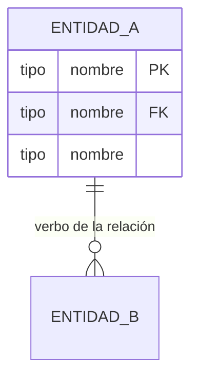

# Step 09 — Modelo de Información (ERD + Estados)

## Objetivo

Capturar las entidades del dominio, sus atributos, relaciones y **estados/transiciones** (crítico para Claude Code). Generar ERD mermaid automáticamente.

## Preguntas

### P1 — Inferencia inicial de entidades (auto + validación)
A partir de las capacidades, actores y procesos capturados, **propón al usuario una lista inicial de entidades**. Por ejemplo:
> Basado en lo que me contaste, identifico estas entidades principales: Cliente, Suscripción, Cobro, Pago, MetodoPago, Notificacion. ¿Coincide? ¿Falta o sobra alguna?

Captura como `modelo.entidades: [{ nombre }]`. Permite al usuario agregar/quitar.

### P2 — Por cada entidad: atributos (libre, lista)
Para cada entidad propuesta:
> Para `{{Entidad}}`: dame los atributos. Cada uno con tipo (texto / número / fecha / booleano / id / enum). Marca con `*` los obligatorios.

Captura como `modelo.entidades[i].atributos: [{ nombre, tipo, obligatorio, descripcion?, valores_enum?: string[] }]`.

Si el usuario olvida atributos típicos (id, created_at, updated_at), sugierelos: "¿Agregamos `id` (uuid), `created_at` (timestamp), `updated_at` (timestamp)?".

### P3 — Relaciones entre entidades (libre, lista)
> Ahora vamos a las relaciones. Para cada par de entidades relacionadas dime: 1) qué entidad apunta a cuál, 2) si es 1-1, 1-N, o N-N, 3) si es obligatoria u opcional. Ejemplo: "Un Cliente tiene muchas Suscripciones (1-N), obligatorio que cada Suscripción tenga Cliente."

Captura como `modelo.relaciones: [{ entidad_a, entidad_b, cardinalidad: '1-1'|'1-N'|'N-N', obligatoria_a, obligatoria_b, descripcion }]`.

### P4 — Entidades con estado (libre, lista)
> ¿Qué entidades tienen un ciclo de vida con estados distintos? Por ejemplo: una Suscripción puede estar `activa`, `pausada`, `cancelada`, `vencida`. Un Cobro puede estar `pendiente`, `pagado`, `vencido`, `cancelado`.

Para cada entidad con estado:
- Lista de estados posibles
- Estado inicial
- Transiciones permitidas (de → a → evento que dispara)

Captura como `modelo.estados: [{ entidad, estados: string[], inicial, transiciones: [{ de, a, evento }] }]`.

### P5 — Reglas de integridad y validaciones (libre, lista)
> ¿Hay reglas de integridad o validaciones a nivel de datos? Por ejemplo: "un cliente no puede tener dos suscripciones activas al mismo plan", "el monto del pago no puede exceder el saldo del cobro", "el email debe ser único".

Captura como `modelo.reglas: string[]`.

## Generación auto del ERD

A partir de `modelo.entidades` + `modelo.relaciones`, genera un ERD mermaid:



Cardinalidad mermaid:
- `||--o{` = 1-N obligatoria-opcional
- `||--||` = 1-1 obligatoria
- `}o--o{` = N-N opcional

## Output markdown

```markdown
## 9. Modelo de Información

### Diagrama entidad-relación (ERD)

\`\`\`mermaid
{{ERD generado}}
\`\`\`

### Estados y transiciones

{{Por cada entidad con estado:}}
#### {{Entidad}}

- **Estados posibles:** {{lista}}
- **Estado inicial:** {{inicial}}
- **Transiciones:**

| De | A | Evento que dispara |
|---|---|---|
{{filas de transiciones}}

### Reglas de integridad

{{lista bullet de modelo.reglas}}
```

Sigue el patrón del ejemplo en `references/ejemplo-logistics-ops-hub.md` (líneas 381-497) — pero **agrega la sección de Estados y transiciones** que no existía en el original.
